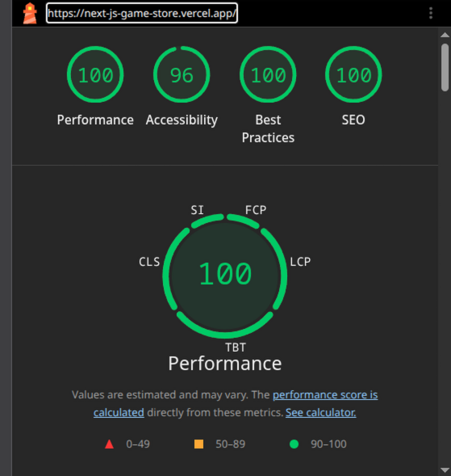
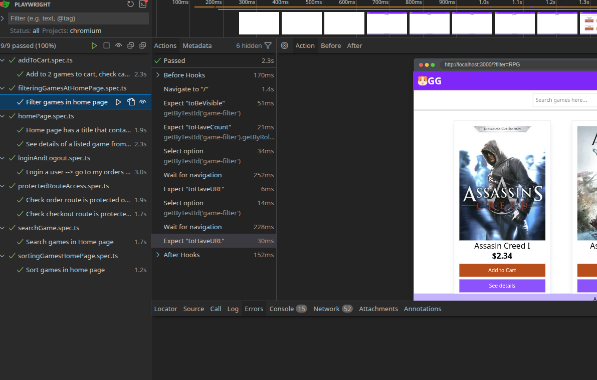

The app is deployed at: https://next-js-game-store.vercel.app/orders


# A Next.js e-commerce store with following features
* Product listing (searching, sorting and filtering)
* Product suggestions
* Cart
* Checkout with stripe payment gateway
* User orders listed
* Protected routes
* Email and password signup and login

## Development features
* App router 
* Zustand state management
* Supabase - Auth, Users, products, carts 
* Stripe Integration
* Vitest test cases
* Playwright test cases
* Docker image
* CI/CD pipeline (GitHub Actions)
* SEO work on SSR pages - home, product details


## Getting Started

First, run the development server:

```
npm i
npm run dev
```

#### Project will run on localhost:3000


## Lightout results of deployed app



### To run playwright test cases

```
npm run playwright-ui
```

```
// To run on headless UI 
npx playwright test --ui 

// To run on chromim
npm playwright test --project=chromium
```

## To run vitest tests
```
npm run dom-test -  for UI
```
```
npm run test
```


## Run docker on local
need your .env file for environment variables
```
docker compose up

```
